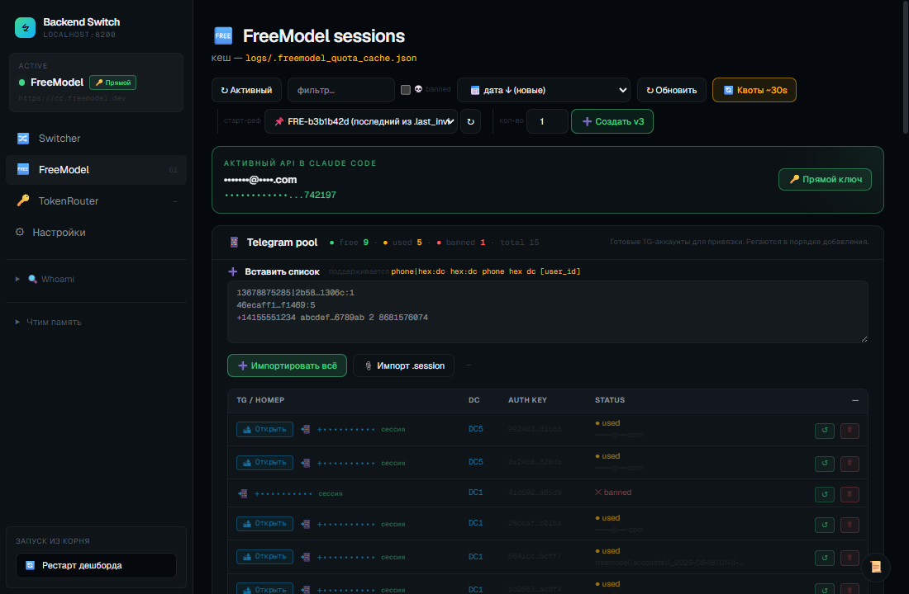
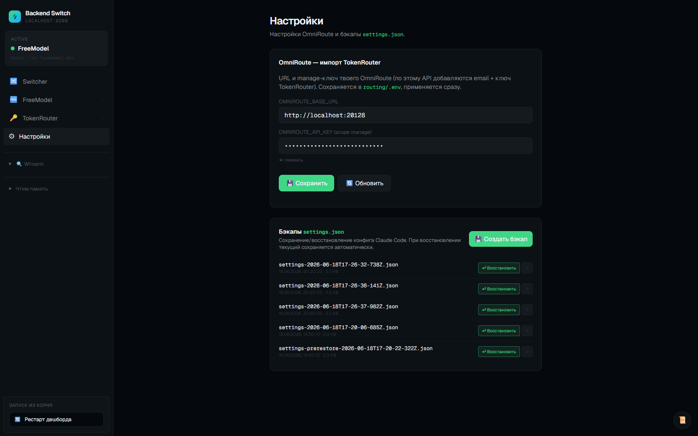

<div align="center">

# Vibe-Code Account Creator Manager

Локальная control-plane для автореги аккаунтов (`FreeModel` · `TokenRouter`) и переключения backend'а Claude Code между **FreeModel**, **OmniRoute** и **TokenRouter** — одним кликом из веб-дашборда.

<br>


<sub>Backend Switch · <code>localhost:8200/__switch</code> — переключение backend'а Claude Code (FreeModel / API Helper / OmniRoute) одним кликом</sub>

<br>

</div>

## Установка

Нужно: **Node.js + npm**, **Python 3** (только для TokenRouter) и запущенный **OmniRoute** на `:20128` (если используешь бэкенд OmniRoute).

**1. Node-зависимости и браузер Playwright**

```bash
npm install
npx playwright install chromium
```

**2. Python и Camoufox** — только для вкладки TokenRouter (Firefox + patched Juggler)

```bash
pip install camoufox requests
python -m camoufox fetch
```

**2b. Telegram session opener** (опционально) — для кнопки **✈ Открыть** (открыть TG-сессию пула в портативном Telegram Desktop). Нужен **Python 3.12** (`opentele` тянет `telethon` + `PyQt5`).

```bash
python3.12 -m venv tools/tg-venv
tools/tg-venv/Scripts/pip install -r tools/tg-venv-requirements.txt
```

Скачай **портативный Telegram Desktop** и положи бинарь в `tools/telegram-portable/Telegram/Telegram.exe`. Профили сессий складываются в `tools/tg-profiles/<phone>/` (всё в `.gitignore`).

**3. Конфиг**

```bash
cp routing/.env.example routing/.env
```

**4. Запуск дашборда** — поднимает freemodel-rotator `:20126` и switcher `:8200`

```bash
routing\restart-dashboard.bat
```

Вручную: `node routing/freemodel-rotator.js` и `node routing/transparent-proxy.js`. Альтернатива — TUI-меню: `node menu.js`.

**5. Открой дашборд** → <http://localhost:8200/__switch>

**6. OmniRoute API-ключ** — для бэкенда OmniRoute

Создай в своём OmniRoute API-ключ со scope **manage**, затем в дашборде открой **⚙ Настройки** → впиши его в `OMNIROUTE_API_KEY` → 💾 **Сохранить**. Ключ запишется в `routing/.env` и применится сразу, без рестарта.

## Что это

Автореги под одной крышей + веб-дашборд, который переключает backend Claude Code и менеджит все сессии:

<div align="center">

| Саб-система | Что делает | Файлы |
| :--- | :--- | :--- |
| **FreeModel** | Аккаунты `freemodel.dev` (Claude через клуб) + пул Telegram для привязки + ротация ключей | `freemodel/` · `internal/freemodel-manager.js` · `routing/freemodel-rotator.js` |
| **TokenRouter** | Аккаунты `tokenrouter.me` через Camoufox-автореги; трекинг баланса / health / usage | `routing/tokenrouter/` · `camoufox_autoreg.py` |
| **Backend Switch** | Web-UI на `:8200` — переключатель backend + менеджер всех сессий | `routing/transparent-proxy.js` · `routing/proxy-dashboard.html` |

</div>

## Дашборд

`http://localhost:8200/__switch`. Сайдбар: **Switcher · FreeModel · TokenRouter · Настройки** (+ Whoami).

### Switcher

Переключает Claude Code между бэкендами одним кликом — переписывает `~/.claude/settings.json` (с `.bak-<timestamp>` бэкапом). После — **перезапустить Claude Code**.

<div align="center">

| | Backend | Когда |
| :---: | :--- | :--- |
| 🟢 | **FreeModel** — `cc.freemodel.dev` (через ротатор `FREEMODEL_ROTATOR` на `:20126`) | основной — пул ключей, авто-ротация |
| 🔀 | **OmniRoute** — `localhost:20128/v1` | Pro/Max OAuth + локальный пул |

</div>

> [!IMPORTANT]
> Реальные API-ключи живут в `routing/.env` (gitignored); роутер подменяет их на лету, а CC получает только литеральный токен. Если в `settings.json` попал не тот ключ → `Not logged in · Please run /login` → откат `routing\PANIC-restore-omniroute.bat`.

**Whoami** — вставляешь ID из лога OmniRoute (`anthropic-compatible-...:fd48f370-...`), скрипт находит email / name / status в локальной БД.

### FreeModel



Менеджер сессий `freemodel.dev` с квотами и пулом Telegram-привязок.

- **Активный API в Claude Code** — какой ключ сейчас в `settings.json`. Бейдж режима: 🔑 **Прямой ключ** (`env.ANTHROPIC_API_KEY`) или 🤝 **API Helper** (`apiKeyHelper` читает `~/.claude/fm-active-key.txt`). На каждой сессии — тумблер 🔑 Ключ / 🤝 Helper.
- **Telegram pool** — готовые TG-аккаунты для привязки к новым freemodel-аккаунтам. Расходуются по порядку: `free → used → banned`.
  - **Импорт** списком: `phone|hex:dc`, `hex:dc`, `phone hex dc [user_id]` (по строке на акк) — или загрузкой `.session` (Pyrogram/Telethon).
  - `hex:dc` без номера → имя-плейсхолдер `tg_<hex8>`; привязка идёт по `auth_key`, **номер не нужен**. Тег источника: **сессия** (`.session`) / **вручную** (hex).
  - **✈ Открыть** — открыть сессию в портативном Telegram Desktop (`tools/tg-open.py` → `opentele`, `UseCurrentSession`). Отдельный `-workdir` на аккаунт — твой основной клиент не трогается.
- **Сессии** — таблица с таймером, доступным `$`, окнами 5h/7d и квотой. **➕ Создать v3** реги пачкой, **🔄 Квоты ~30s** перепрогон через headless Chrome.

**Цвет квоты:** 🟢 < 40% · 🟡 40–70% · 🔴 > 70%

### TokenRouter


Аккаунты `tokenrouter.me`, зарегистрированные через Camoufox (`routing/tokenrouter/camoufox_autoreg.py`). Данные — `routing/tokenrouter/accounts.json` (gitignored).

<div align="center">

| Колонка | Что |
| :--- | :--- |
| **Health** | 🟢 LIVE / ❌ ERR — живой ли ключ |
| **Daily usage** | прогресс-бар расхода против дневного лимита (`$1`/день) |
| **Timer** | когда обнулится дневной лимит |

</div>

Кнопки: **➕ Создать аккаунт** (Camoufox-реги), **🔍 Проверить все**, **💰 Обновить балансы**, **✏ Вручную** (импорт готового). На каждой строке — **⬆ Импорт** ключа в OmniRoute / **🗑 Из OmniRoute** (по manage-API из «Настроек»).

### Настройки



- **OmniRoute — импорт TokenRouter** — `OMNIROUTE_BASE_URL` + manage-ключ, по которому кнопки ⬆ Импорт добавляют email+ключ TokenRouter в OmniRoute. Пишется в `routing/.env`, применяется сразу без рестарта.
- **Бэкапы `settings.json`** — создать / ↩ восстановить / 🗑 удалить конфиг Claude Code (`~/.claude/settings-backups/`). При восстановлении текущий сохраняется автоматически.

## Архитектура

Claude Code читает `~/.claude/settings.json`, берёт оттуда `ANTHROPIC_BASE_URL` + ключ и шлёт запросы в выбранный бэкенд: **FreeModel** через ротатор на `:20126` → `cc.freemodel.dev`, либо **OmniRoute** на `:20128/v1`. **Switcher** на `:8200` (`transparent-proxy.js`) переписывает `settings.json` одним кликом и кладёт `.bak-<timestamp>` рядом. Реальные ключи — в `routing/.env` (gitignored); CC получает только литералку, которую роутер подменяет.

<div align="center">


<sub>🟢 FreeModel · 🔵 OmniRoute · 🟣 локальная control-plane (Switcher + .env)</sub>

</div>

## OpenCode

OmniRoute — обычный OpenAI-совместимый endpoint, поэтому в него можно ходить не только из Claude Code, но и из [OpenCode](https://opencode.ai). Добавь провайдер в `opencode.json` (рядом с проектом или в `~/.config/opencode/`) — ключ тот же `OMNIROUTE_API_KEY`, что и в `routing/.env`. Бонус: разные агенты роутятся на разные модели через один OmniRoute (`review` → DeepSeek, `architect` → Qwen).

<details>
<summary><b>opencode.json</b> — провайдер OmniRoute + пример агентов</summary>

```json
{
  "$schema": "https://opencode.ai/config.json",
  "model": "omniroute/tokenrouter/kimi-k2p7-code",
  "small_model": "omniroute/tokenrouter/deepseek-v4-flash",
  "provider": {
    "omniroute": {
      "npm": "@ai-sdk/openai-compatible",
      "name": "OmniRoute",
      "options": {
        "baseURL": "http://localhost:20128/v1",
        "apiKey": "<OMNIROUTE_API_KEY>",
        "timeout": 600000
      },
      "models": {
        "tokenrouter/deepseek-v4-pro":      { "name": "DeepSeek V4 Pro" },
        "tokenrouter/deepseek-v4-flash":    { "name": "DeepSeek V4 Flash" },
        "tokenrouter/glm-5p1":              { "name": "GLM 5.1" },
        "tokenrouter/glm-5p1-fast":         { "name": "GLM 5.1 Fast" },
        "tokenrouter/gpt-oss-120b":         { "name": "GPT-OSS 120B" },
        "tokenrouter/kimi-k2p5":            { "name": "Kimi K2.5" },
        "tokenrouter/kimi-k2p6":            { "name": "Kimi K2.6" },
        "tokenrouter/kimi-k2p7-code":       { "name": "Kimi K2.7 Code" },
        "tokenrouter/kimi-k2p7-code-fast":  { "name": "Kimi K2.7 Code Fast" },
        "tokenrouter/minimax-m2p7":         { "name": "MiniMax M2.7" },
        "tokenrouter/minimax-m3":           { "name": "MiniMax M3" },
        "tokenrouter/qwen3p6-plus":         { "name": "Qwen 3.6 Plus" },
        "tokenrouter/qwen3p7-plus":         { "name": "Qwen 3.7 Plus" }
      }
    }
  },
  "agent": {
    "review": {
      "description": "Баг-хантер",
      "model": "omniroute/tokenrouter/deepseek-v4-pro",
      "prompt": "You are a senior code reviewer. Find bugs, security issues, and bad patterns. Be concise.",
      "tools": { "write": false, "edit": false, "bash": false }
    },
    "architect": {
      "description": "План перед кодом",
      "model": "omniroute/tokenrouter/qwen3p7-plus",
      "prompt": "You are a software architect. Output a numbered implementation checklist.",
      "tools": { "write": false, "edit": false }
    }
  }
}
```
</details>

## Скрипты

<details>
<summary><b>FreeModel</b></summary>

```bash
node freemodel/freemodel_autoreger_v3.js          # автореги
node freemodel/freemodel_autoreger_v3.js 5        # 5 подряд
node freemodel/freemodel_autoreger_v3.js 5 FRE-x  # override стартового инвайта
```
</details>

<details>
<summary><b>TokenRouter</b></summary>

```bash
python routing/tokenrouter/camoufox_autoreg.py        # 1 аккаунт
python routing/tokenrouter/camoufox_autoreg.py 5      # 5 подряд
```
</details>

<details>
<summary><b>Routing</b></summary>

```bash
routing\restart-dashboard.bat            # рестарт rotator :20126 + switcher :8200
routing\PANIC-restore-omniroute.bat      # откат settings.json на OmniRoute
node routing/transparent-proxy.js        # switcher вручную
```
</details>

## Конфигурация

<div align="center">

| Файл | Что |
| :--- | :--- |
| `freemodel/config.js` | FreeModel — URLs, паттерны email, таймауты |
| `routing/.env` | **Секреты** (gitignored) — `OMNIROUTE_API_KEY` |
| `~/.claude/settings.json` | Активный backend (Switcher редактирует) |

</div>

## Структура

<div align="center">

| Папка / файл | Что |
| :--- | :--- |
| `routing/transparent-proxy.js` | Switcher :8200 + HTTP API дашборда |
| `routing/proxy-dashboard.html` | UI (Tailwind) |
| `routing/freemodel-rotator.js` | Ротатор FreeModel-ключей :20126 |
| `routing/tokenrouter/camoufox_autoreg.py` | TokenRouter автореги (Camoufox) |
| `routing/restart-dashboard.bat` | One-click рестарт rotator + switcher |
| `routing/PANIC-restore-omniroute.bat` | Откат `settings.json` на OmniRoute |
| `routing/.env` | _gitignored_ — реальные ключи |
| `internal/dashboard-api.js` | Прослойка CLI ↔ HTTP |
| `internal/freemodel-manager.js` | FreeModel-сессии + квоты + TG-пул |
| `freemodel/` · `routing/tokenrouter/` | Auto-reg скрипты |
| `tools/tg-open.py` | Открытие TG-сессии в портативном Telegram Desktop (opentele) |
| `tools/{tg-venv,telegram-portable,tg-profiles}` | _gitignored_ — venv, бинарь Telegram, tdata-профили |
| `manual_sessions/` · `ready_to_sell/` · `errors/` | _gitignored_ — сессии и ошибки |
| `menu.js` | TUI-меню (всё-в-одном) |

</div>

## Troubleshooting

<table>
<tr><th align="left">Симптом</th><th align="left">Причина / фикс</th></tr>
<tr>
  <td>CC говорит <code>Not logged in · Please run /login</code></td>
  <td>В <code>settings.json</code> попал не тот ключ →&nbsp; <code>routing\PANIC-restore-omniroute.bat</code></td>
</tr>
<tr>
  <td>Дашборд не открывается / <code>:8200</code> занят</td>
  <td><code>routing\restart-dashboard.bat</code> — сам убивает старый процесс на :8200 (и legacy :8300)</td>
</tr>
<tr>
  <td>TokenRouter «Создать аккаунт» падает</td>
  <td>Нет Camoufox: <code>pip install camoufox requests</code> + <code>python -m camoufox fetch</code></td>
</tr>
<tr>
  <td>Кнопка ➕ «Создать сессию» не открывает окно</td>
  <td>Скрипт через <code>cmd /c start</code>. Сервер без интерактивной сессии → запускай через <code>node menu.js</code></td>
</tr>
<tr>
  <td>Квоты в кеше устарели</td>
  <td>Кнопка <b>🔄 Квоты ~30s</b> в табе — перепрогон через headless Chrome</td>
</tr>
<tr>
  <td><b>✈ Открыть</b> падает / <code>нет tools/tg-venv</code></td>
  <td>Не создан venv или нет бинаря — см. install шаг <b>2b</b> (<code>opentele</code> + портативный Telegram в <code>tools/telegram-portable/Telegram/Telegram.exe</code>). Проверка: <code>tools/tg-venv/Scripts/python.exe tools/tg-open.py &lt;phone&gt; --check</code></td>
</tr>
</table>

## Безопасность

- Реальные API-ключи — в `routing/.env` (gitignored)
- `settings.json` бэкапится перед каждым изменением (`*.bak-<timestamp>`)
- Приватные данные gitignored: `manual_sessions/` · `ready_to_sell/` · `freemodel/sessions/` · `freemodel/tg_pool.json` · `routing/tokenrouter/accounts.json` · Camoufox-профили · скриншоты (`*.png`)

Перед коммитом полезно:
```bash
git diff --cached | grep -E "sk-[a-z]{2,}-[a-f0-9]+|auth_key_hex" || echo "OK: no keys in staged diff"
```

## Disclaimer

Образовательные цели. Используй в рамках ToS соответствующих сервисов (FreeModel, TokenRouter, Anthropic).

## License

MIT
