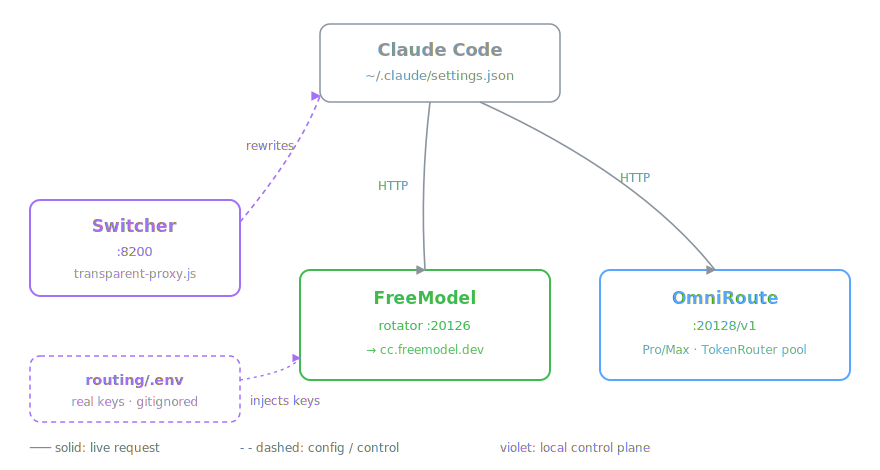

<div align="center">

# Vibe-Code Account Creator Manager

Локальная control-plane для управления `Devin` · `Notion` · `FreeModel` аккаунтами и переключения backend'ов Claude Code между OmniRoute и notion-manager.

<br>


<sub>Web-UI на <code>localhost:8200</code></sub>

<br>

</div>

## Установка

```bash
npm install
npx playwright install chromium

cp routing/.env.example routing/.env
# заполни OMNIROUTE_API_KEY и NOTION_API_KEY

routing\restart-dashboard.bat   # Windows: один клик
# или: node routing/transparent-proxy.js

# открой http://localhost:8200/__switch
```

Альтернатива — классическое TUI меню: `node menu.js`

## Что это

Три независимых саб-системы под одной крышей:

| Саб-система | Что делает | Файлы |
| :--- | :--- | :--- |
| **Devin** autoreg | Pro-аккаунты `devin.ai` с картой / прокси / локалью | `autoreger.js` · `internal/` · `menu.js` |
| **Notion** autoreg | Notion-аккаунты + привязка карты + фикс trial | `notion/` · `notion_workflow.js` |
| **FreeModel** sessions | Менеджит сессии `freemodel.dev` (Claude через клуб) | `freemodel/` · `manual_sessions/` |
| **Routing** dashboard | Web-UI на `:8200` — переключатель backend + менеджер всех 3х систем | `routing/` · `internal/dashboard-api.js` |

## Routing dashboard

Открой `http://localhost:8200/__switch` — четыре вкладки в сайдбаре.

### Switcher

Переключает Claude Code между двумя бэкендами одним кликом.

| | Backend | Когда |
| :---: | :--- | :--- |
| 🟢 | **FreeModel** — `OmniRoute :20128` | основной — tools, vision, длинные сессии |
| 🔵 | **Notion** — `notion-manager :8190` | cheap — короткие запросы без tools |

Клик переписывает `~/.claude/settings.json` (с `.bak-<timestamp>` бэкапом). После — **перезапустить Claude Code**.

> [!IMPORTANT]
> CC принимает в `settings.json` **только** ключ `sk-local-dev-key` (внутренний bypass-токен OmniRoute). Любой другой даёт `Not logged in · Please run /login`. Реальные API-ключи живут в `routing/.env` (gitignored).

**Whoami** — вставляешь ID из лога OmniRoute (`anthropic-compatible-...:fd48f370-...`), скрипт находит email / name / status в локальной БД OmniRoute.

### Devin · FreeModel · Notion

Список сессий с прогресс-барами квот и действиями на каждой строке.

**Цвет квоты:** 🟢 < 40% · 🟡 40 – 70% · 🔴 > 70%

| Кнопка | Действие |
| :---: | :--- |
| 🌐 | Открыть в headed Chrome |
| 🔄 | Обновить квоту (headless ~1–3s) |
| ➕ | Создать новую сессию |
| 🗑 | Удалить папку + кеш |

**Сортировка:** дата ↑/↓ · статус · план Pro→Free · квота · доступно `$` · свежесть кеша · email.

### Card picker

Notion-таб: 3 карты-пресета (`CARD_PRESETS` из `notion/config.js`) + **Ротация**. Клик — `CARD_PRESET_INDEX` обновляется regex-replace, без рестарта.

## Архитектура

Claude Code читает `~/.claude/settings.json` — берёт оттуда `ANTHROPIC_BASE_URL` и шлёт API-запросы в выбранный бэкенд: **OmniRoute** на `:20128/v1` (Pro/Max OAuth + пул FreeModel) или **notion-manager** на `:8190` (Notion bypass).

**Switcher** на `:8200` (`routing/transparent-proxy.js`) переписывает `settings.json` одним кликом и кладёт `.bak-<timestamp>` рядом. Реальные API-ключи живут в `routing/.env` (gitignored) и подставляются роутером — CC получает только литералку `sk-local-dev-key`.

<div align="center">



<sub>🟢 OmniRoute · 🔵 notion-manager · 🟣 локальная control-plane (Switcher + .env)</sub>

</div>

## Скрипты

<details>
<summary><b>Devin</b></summary>

```bash
node autoreger.js                  # создание аккаунтов
node internal/bin-lookup.js        # BIN-генератор (148 BIN, 12 стран)
```
</details>

<details>
<summary><b>Notion</b></summary>

```bash
node notion/notion_workflow.js     # создать Notion-аккаунт с картой
```
</details>

<details>
<summary><b>FreeModel</b></summary>

```bash
node freemodel/freemodel_autoreger_v3.js          # автореги (instanttempemail)
node freemodel/freemodel_autoreger_v3.js 5        # 5 аккаунтов подряд
node freemodel/freemodel_autoreger_v3.js 5 FRE-x  # override стартового инвайта

node freemodel/create_first_session.js
node freemodel/login_and_save_session.js
node freemodel/restore_session.js
```
</details>

<details>
<summary><b>Routing</b></summary>

```bash
routing\restart-dashboard.bat            # рестарт :8200 (Windows)
routing\PANIC-restore-omniroute.bat      # откат settings.json на OmniRoute
node routing/transparent-proxy.js        # switcher вручную
node routing/smart-router-v3.js          # auto-router :8201 (экспериментальный)
```
</details>

## Конфигурация

| Файл | Что |
| :--- | :--- |
| `config.js` | Devin — BINs, proxy, billing, headless, sound, timing |
| `notion/config.js` | Notion — CARD_PRESETS, CARD_PRESET_INDEX, proxy, viewport |
| `freemodel/config.js` | FreeModel — URLs, паттерны email, таймауты |
| `routing/.env` | **Секреты** (gitignored) — `OMNIROUTE_API_KEY`, `NOTION_API_KEY` |
| `~/.claude/settings.json` | Активный backend (Switcher редактирует) |

## Структура

| Папка / файл | Что |
| :--- | :--- |
| `routing/transparent-proxy.js` | Switcher :8200 + HTTP API дашборда |
| `routing/proxy-dashboard.html` | Tailwind v4 UI |
| `routing/smart-router-v3.js` | Авто-роутер :8201 (экспериментальный) |
| `routing/restart-dashboard.bat` | One-click рестарт |
| `routing/PANIC-restore-omniroute.bat` | Откат `settings.json` на OmniRoute |
| `routing/.env` | _gitignored_ — реальные ключи |
| `internal/dashboard-api.js` | Прослойка CLI ↔ HTTP |
| `internal/devin-manager.js` | Devin-сессии (manual + ready + errors) |
| `internal/freemodel-manager.js` | FreeModel-сессии + квоты |
| `internal/notion-manager.js` | Notion-сессии |
| `internal/autoreger.js` | Логика создания Devin-аккаунтов |
| `internal/bin-lookup.js` | БД BIN + Luhn-генератор |
| `notion/`, `freemodel/` | Auto-reg скрипты |
| `manual_sessions/`, `ready_to_sell/`, `errors/` | _gitignored_ — сессии и ошибки |
| `menu.js` | TUI-меню (всё-в-одном) |
| `autoreger.js`, `start.js`, `config.js` | Devin entry-points + конфиг |

## Troubleshooting

<table>
<tr><th align="left">Симптом</th><th align="left">Причина / фикс</th></tr>
<tr>
  <td>CC говорит <code>Not logged in · Please run /login</code></td>
  <td>В <code>settings.json</code> подставлен реальный ключ вместо <code>sk-local-dev-key</code> →&nbsp; <code>routing\PANIC-restore-omniroute.bat</code></td>
</tr>
<tr>
  <td>Дашборд не открывается / <code>:8200</code> занят</td>
  <td><code>routing\restart-dashboard.bat</code> — сам убивает старый процесс</td>
</tr>
<tr>
  <td>Кнопка ➕ «Создать сессию» не открывает окно</td>
  <td>Скрипт через <code>cmd /c start</code>. Windows-сервер без интерактивной сессии → запускай через <code>node menu.js</code></td>
</tr>
<tr>
  <td>Квоты в кеше устарели</td>
  <td>Кнопка <b>🔄 Квоты ~30s</b> в табе — перепрогон через headless Chrome</td>
</tr>
<tr>
  <td>Whoami ничего не находит</td>
  <td>Парсит 8-символьные hex-префиксы. Если в строке нет UUID-фрагмента — нет совпадения. Если есть — нет такого аккаунта в <code>~/.omniroute/storage.sqlite</code></td>
</tr>
</table>

## Безопасность

- Все реальные API-ключи — в `routing/.env` (gitignored)
- `settings.json` бэкапится перед каждым изменением (`*.bak-<timestamp>`)
- Сессии (`manual_sessions/`, `ready_to_sell/`, `notion/sessions/`, `freemodel/sessions/`) — gitignored
- Скриншоты ошибок (`*.png`) — gitignored

Перед коммитом полезно:
```bash
git diff --cached | grep -E "sk-[a-z]{2,}-[a-f0-9]+" || echo "OK: no keys in staged diff"
```

## Community

[**t.me/abuz_ai**](https://t.me/abuz_ai) — присоединяйся.

## Disclaimer

Образовательные цели. Используй в рамках ToS соответствующих сервисов (Devin.ai, Notion, FreeModel, Anthropic).

## License

MIT
