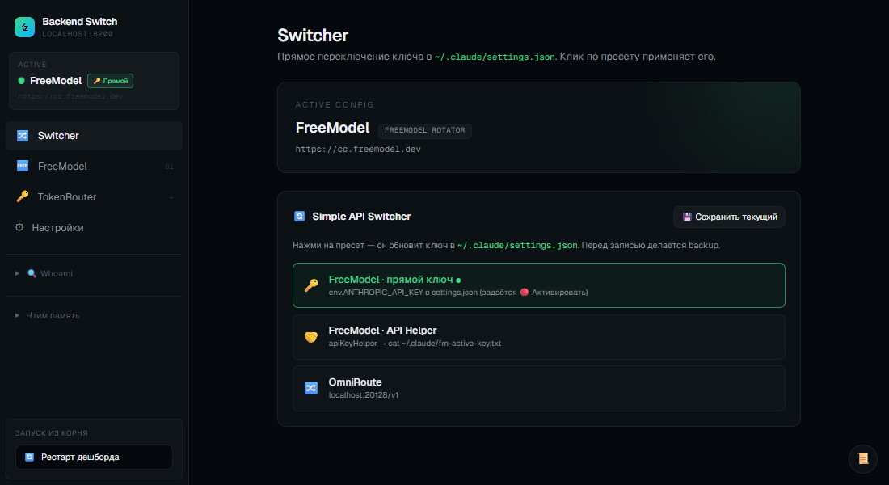
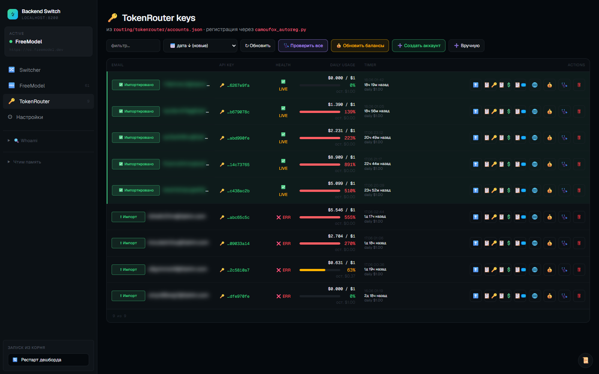

<div align="center">

# Vibe-Code Account Creator Manager

Локальная control-plane для автореги аккаунтов (`FreeModel` · `TokenRouter` · `Devin` · `Notion`) и переключения backend'а Claude Code между **FreeModel**, **OmniRoute** и **TokenRouter** — одним кликом из веб-дашборда.

<br>



<sub>Backend Switch · <code>localhost:8200/__switch</code> — менеджер FreeModel-сессий с пулом Telegram-привязок и квотами</sub>

<br>

</div>

## Установка

```bash
# 1. Node-зависимости + браузер для Playwright (FreeModel / Devin / Notion)
npm install
npx playwright install chromium

# 2. Python + Camoufox — только для вкладки TokenRouter (Firefox + patched Juggler)
pip install camoufox requests
python -m camoufox fetch          # скачивает браузер один раз

# 3. Секреты
cp routing/.env.example routing/.env
#   заполни OMNIROUTE_API_KEY (+ NOTION_API_KEY, если юзаешь Notion-бэкенд)

# 4. Запуск дашборда (поднимает freemodel-rotator :20126 + switcher :8200)
routing\restart-dashboard.bat     # Windows — один клик, сам убивает старый процесс
# или вручную:
#   node routing/freemodel-rotator.js
#   node routing/transparent-proxy.js

# 5. Открой http://localhost:8200/__switch
```

> [!NOTE]
> Python/Camoufox нужен **только** для TokenRouter. FreeModel/Devin/Notion работают на Playwright (Chromium).

Альтернатива — классическое TUI-меню: `node menu.js`

## Что это

Автореги под одной крышей + веб-дашборд, который переключает backend Claude Code и менеджит все сессии:

| Саб-система | Что делает | Файлы |
| :--- | :--- | :--- |
| **FreeModel** | Аккаунты `freemodel.dev` (Claude через клуб) + пул Telegram для привязки + ротация ключей | `freemodel/` · `internal/freemodel-manager.js` · `routing/freemodel-rotator.js` |
| **TokenRouter** | Аккаунты `tokenrouter.me` через Camoufox-автореги; трекинг баланса / health / usage | `routing/tokenrouter/` · `camoufox_autoreg.py` |
| **Devin** | Pro-аккаунты `devin.ai` с картой / прокси / локалью | `autoreger.js` · `internal/` · `menu.js` |
| **Notion** | Notion-аккаунты + привязка карты + фикс trial | `notion/` · `notion_workflow.js` |
| **Backend Switch** | Web-UI на `:8200` — переключатель backend + менеджер всех сессий | `routing/transparent-proxy.js` · `routing/proxy-dashboard.html` |

## Дашборд

`http://localhost:8200/__switch`. Сайдбар: **Switcher · FreeModel · TokenRouter · Настройки** (+ Whoami).

### Switcher

Переключает Claude Code между бэкендами одним кликом — переписывает `~/.claude/settings.json` (с `.bak-<timestamp>` бэкапом). После — **перезапустить Claude Code**.

| | Backend | Когда |
| :---: | :--- | :--- |
| 🟢 | **FreeModel** — `cc.freemodel.dev` (через ротатор `FREEMODEL_ROTATOR` на `:20126`) | основной — пул ключей, авто-ротация |
| 🔀 | **OmniRoute** — `localhost:20128/v1` | Pro/Max OAuth + локальный пул |

> [!IMPORTANT]
> Реальные API-ключи живут в `routing/.env` (gitignored); роутер подменяет их на лету, а CC получает только литеральный токен. Если в `settings.json` попал не тот ключ → `Not logged in · Please run /login` → откат `routing\PANIC-restore-omniroute.bat`.

**Whoami** — вставляешь ID из лога OmniRoute (`anthropic-compatible-...:fd48f370-...`), скрипт находит email / name / status в локальной БД.

### FreeModel

Менеджер сессий `freemodel.dev` с квотами и пулом Telegram-привязок.

- **Активный API в Claude Code** — какой ключ сейчас в `settings.json`.
- **Telegram pool** — готовые TG-аккаунты (`phone|auth_key_hex:dc`) для привязки к новым freemodel-аккаунтам. Расходуются по порядку: `free → used → banned`. Импорт списком или `.session`.
- **Сессии** — таблица с таймером, доступным `$`, окнами 5h/7d и квотой. **➕ Создать v3** реги пачкой, **🔄 Квоты ~30s** перепрогон через headless Chrome.

**Цвет квоты:** 🟢 < 40% · 🟡 40–70% · 🔴 > 70%

### TokenRouter



Аккаунты `tokenrouter.me`, зарегистрированные через Camoufox (`routing/tokenrouter/camoufox_autoreg.py`). Данные — `routing/tokenrouter/accounts.json` (gitignored).

| Колонка | Что |
| :--- | :--- |
| **Health** | 🟢 LIVE / ❌ ERR — живой ли ключ |
| **Daily usage** | прогресс-бар расхода против дневного лимита (`$1`/день) |
| **Timer** | когда обнулится дневной лимит |

Кнопки: **➕ Создать аккаунт** (Camoufox-реги), **🔍 Проверить все**, **💰 Обновить балансы**, **✏ Вручную** (импорт готового). На каждой строке — **⬆ Импорт** ключа в OmniRoute / **🗑 Из OmniRoute** (по manage-API из «Настроек»).

### Настройки

- **OmniRoute — импорт TokenRouter** — `OMNIROUTE_BASE_URL` + manage-ключ, по которому кнопки ⬆ Импорт добавляют email+ключ TokenRouter в OmniRoute. Пишется в `routing/.env`, применяется сразу без рестарта.
- **Бэкапы `settings.json`** — создать / ↩ восстановить / 🗑 удалить конфиг Claude Code (`~/.claude/settings-backups/`). При восстановлении текущий сохраняется автоматически.

## Архитектура

Claude Code читает `~/.claude/settings.json`, берёт оттуда `ANTHROPIC_BASE_URL` + ключ и шлёт запросы в выбранный бэкенд: **FreeModel** через ротатор на `:20126` → `cc.freemodel.dev`, либо **OmniRoute** на `:20128/v1`. **Switcher** на `:8200` (`transparent-proxy.js`) переписывает `settings.json` одним кликом и кладёт `.bak-<timestamp>` рядом. Реальные ключи — в `routing/.env` (gitignored); CC получает только литералку, которую роутер подменяет.

## Скрипты

<details>
<summary><b>FreeModel</b></summary>

```bash
node freemodel/freemodel_autoreger_v3.js          # автореги
node freemodel/freemodel_autoreger_v3.js 5        # 5 подряд
node freemodel/freemodel_autoreger_v3.js 5 FRE-x  # override стартового инвайта
```
</details>

<details>
<summary><b>TokenRouter</b></summary>

```bash
python routing/tokenrouter/camoufox_autoreg.py        # 1 аккаунт
python routing/tokenrouter/camoufox_autoreg.py 5      # 5 подряд
```
</details>

<details>
<summary><b>Devin</b></summary>

```bash
node autoreger.js                  # создание аккаунтов
node internal/bin-lookup.js        # BIN-генератор (148 BIN, 12 стран)
```
</details>

<details>
<summary><b>Notion</b></summary>

```bash
node notion/notion_workflow.js     # Notion-аккаунт с картой
```
</details>

<details>
<summary><b>Routing</b></summary>

```bash
routing\restart-dashboard.bat            # рестарт rotator :20126 + switcher :8200
routing\PANIC-restore-omniroute.bat      # откат settings.json на OmniRoute
node routing/transparent-proxy.js        # switcher вручную
```
</details>

## Конфигурация

| Файл | Что |
| :--- | :--- |
| `config.js` | Devin — BINs, proxy, billing, headless, timing |
| `notion/config.js` | Notion — `CARD_PRESETS`, proxy, viewport |
| `freemodel/config.js` | FreeModel — URLs, паттерны email, таймауты |
| `routing/.env` | **Секреты** (gitignored) — `OMNIROUTE_API_KEY`, `NOTION_API_KEY` |
| `~/.claude/settings.json` | Активный backend (Switcher редактирует) |

## Структура

| Папка / файл | Что |
| :--- | :--- |
| `routing/transparent-proxy.js` | Switcher :8200 + HTTP API дашборда |
| `routing/proxy-dashboard.html` | UI (Tailwind) |
| `routing/freemodel-rotator.js` | Ротатор FreeModel-ключей :20126 |
| `routing/tokenrouter/camoufox_autoreg.py` | TokenRouter автореги (Camoufox) |
| `routing/restart-dashboard.bat` | One-click рестарт rotator + switcher |
| `routing/PANIC-restore-omniroute.bat` | Откат `settings.json` на OmniRoute |
| `routing/.env` | _gitignored_ — реальные ключи |
| `internal/dashboard-api.js` | Прослойка CLI ↔ HTTP |
| `internal/freemodel-manager.js` | FreeModel-сессии + квоты + TG-пул |
| `internal/devin-manager.js` · `notion-manager.js` | Devin / Notion сессии |
| `internal/bin-lookup.js` | БД BIN + Luhn-генератор |
| `freemodel/` · `notion/` · `routing/tokenrouter/` | Auto-reg скрипты |
| `manual_sessions/` · `ready_to_sell/` · `errors/` | _gitignored_ — сессии и ошибки |
| `menu.js` | TUI-меню (всё-в-одном) |

## Troubleshooting

<table>
<tr><th align="left">Симптом</th><th align="left">Причина / фикс</th></tr>
<tr>
  <td>CC говорит <code>Not logged in · Please run /login</code></td>
  <td>В <code>settings.json</code> попал не тот ключ →&nbsp; <code>routing\PANIC-restore-omniroute.bat</code></td>
</tr>
<tr>
  <td>Дашборд не открывается / <code>:8200</code> занят</td>
  <td><code>routing\restart-dashboard.bat</code> — сам убивает старый процесс на :8200 (и legacy :8300)</td>
</tr>
<tr>
  <td>TokenRouter «Создать аккаунт» падает</td>
  <td>Нет Camoufox: <code>pip install camoufox requests</code> + <code>python -m camoufox fetch</code></td>
</tr>
<tr>
  <td>Кнопка ➕ «Создать сессию» не открывает окно</td>
  <td>Скрипт через <code>cmd /c start</code>. Сервер без интерактивной сессии → запускай через <code>node menu.js</code></td>
</tr>
<tr>
  <td>Квоты в кеше устарели</td>
  <td>Кнопка <b>🔄 Квоты ~30s</b> в табе — перепрогон через headless Chrome</td>
</tr>
</table>

## Безопасность

- Реальные API-ключи — в `routing/.env` (gitignored)
- `settings.json` бэкапится перед каждым изменением (`*.bak-<timestamp>`)
- Приватные данные gitignored: `manual_sessions/` · `ready_to_sell/` · `freemodel/sessions/` · `freemodel/tg_pool.json` · `routing/tokenrouter/accounts.json` · Camoufox-профили · скриншоты (`*.png`)

Перед коммитом полезно:
```bash
git diff --cached | grep -E "sk-[a-z]{2,}-[a-f0-9]+|auth_key_hex" || echo "OK: no keys in staged diff"
```

## Community

[**t.me/abuz_ai**](https://t.me/abuz_ai) — присоединяйся.

## Disclaimer

Образовательные цели. Используй в рамках ToS соответствующих сервисов (FreeModel, TokenRouter, Devin.ai, Notion, Anthropic).

## License

MIT
