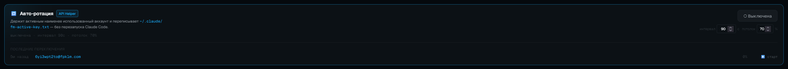

<div align="center">

# Vibe-Code Account Creator Manager

Локальная control-plane для автореги аккаунтов (`FreeModel` · `TokenRouter`) и переключения backend'а Claude Code между **FreeModel**, **OmniRoute** и **TokenRouter** — одним кликом из веб-дашборда.

<br>


<br>

</div>

## Что это

Автореги под одной крышей + веб-дашборд на `:8200`, который переключает backend Claude Code и менеджит все сессии:

<div align="center">

| Саб-система | Что делает | Файлы |
| :--- | :--- | :--- |
| **FreeModel** | Аккаунты `freemodel.dev` (Claude через клуб) + пул Telegram для привязки + ротация ключей | `freemodel/` · `internal/freemodel-manager.js` · `routing/freemodel-rotator.js` |
| **Telegram-сессии** | Менеджер TG-аккаунтов: импорт списком / `.session` / hex, привязка по `auth_key`, открытие в Telegram Desktop, health-check | `freemodel/lib/tg-*.js` · `tools/tg-open.py` |
| **TokenRouter** | Аккаунты `tokenrouter.me` через Camoufox-автореги; трекинг баланса / health / usage | `routing/tokenrouter/` · `camoufox_autoreg.py` |
| **Backend Switch** | Web-UI на `:8200` — переключатель backend + менеджер всех сессий | `routing/transparent-proxy.js` · `routing/proxy-dashboard.html` |

</div>

## Дашборд

`http://localhost:8200/__switch`. Сайдбар: **Switcher · FreeModel · TokenRouter · Настройки** (+ Whoami).

### Switcher

Переключает Claude Code между бэкендами одним кликом — переписывает `~/.claude/settings.json` (с `.bak-<timestamp>`). После — **перезапустить Claude Code**. Как устроена подмена ключей — см. [Архитектуру](#архитектура).

<div align="center">

| | Backend | Когда |
| :---: | :--- | :--- |
| 🟢 | **FreeModel** — `cc.freemodel.dev` (через ротатор `FREEMODEL_ROTATOR` на `:20126`) | основной — пул ключей, авто-ротация |
| 🔀 | **OmniRoute** — `localhost:20128/v1` | Pro/Max OAuth + локальный пул |

</div>

**Whoami** — вставляешь ID из лога OmniRoute (`anthropic-compatible-...:fd48f370-...`), скрипт находит email / name / status в локальной БД.

### FreeModel


Менеджер сессий `freemodel.dev` с квотами и пулом Telegram-привязок.

- **Активный API в Claude Code** — какой ключ сейчас в `settings.json`. Бейдж режима: 🔑 **Прямой ключ** (`env.ANTHROPIC_API_KEY`) или 🤝 **API Helper** (`apiKeyHelper` читает `~/.claude/fm-active-key.txt`). На каждой сессии — тумблер 🔑 Ключ / 🤝 Helper.
- **Сессии** — таблица с таймером, доступным `$`, окнами 5h/7d и квотой (🟢 < 40% · 🟡 40–70% · 🔴 > 70%). **➕ Создать v3** реги пачкой, **🔄 Квоты ~30s** перепрогон через headless Chrome.
- **Telegram pool** — готовые TG-аккаунты для привязки (↓ отдельная секция).

#### Авто-ротация (API Helper балансировщик)



Держит активным наименее использованный аккаунт и переписывает `~/.claude/fm-active-key.txt` — **без перезапуска Claude Code** (`apiKeyHelper` читает файл на каждый запрос, TTL=0).

- **Тумблер вкл/выкл** + настройки: **интервал** (как часто переоцениваем квоты, дефолт 90с) и **потолок** used% (дефолт 70% — при достижении активный уступает место лучшему).
- Каждый тик рефрешит квоты активного + K наименее использованных и выбирает лучший. Переключение по причинам: `no-active`, `ceiling` (активный упёрся в потолок), `balance` (нашёлся заметно свободнее — с гистерезисом, чтобы не дёргать).
- **Последние переключения** — лог свитчей (когда, на какой аккаунт, его used%). Состояние пишется в `logs/.freemodel_autorotate.json` и переживает рестарт прокси.

### Telegram — менеджер сессий

Пул готовых Telegram-аккаунтов прямо в дашборде: **импорт → хранение → привязка к FreeModel → открытие в Telegram Desktop**. Один аккаунт = `auth_key + dc_id`, номер опционален.

- **Добавить** — списком (`phone|hex:dc`, `hex:dc`, `phone hex dc [user_id]` — по строке; разорванный переносами hex склеивается сам) или `.session`-файлом (Pyrogram/Telethon — `auth_key`/`phone`/`user_id` достаются автоматически).
- **`hex:dc` без номера** → имя-плейсхолдер `tg_<hex8>`; привязка и логин идут по `auth_key`. В таблице: источник (`сессия`/`вручную`), статус `free → reserved → used → banned`, маскированный ключ.
- **✈ Открыть** — `auth_key → tdata` (`opentele`, `UseCurrentSession` — без релогина/SMS) → портативный Telegram Desktop, отдельный `-workdir` на каждого; основной клиент (Telegram/AyuGram) не трогается.
- **🩺 Health-чек** — connect + `getMe()` (read-only, бан не триггерит), результат кэшируется. Кнопка на строке (один акк) или в шапке пула (все). Бейдж: 🟢 alive / 🔴 dead / 🟠 ?.

> Зависимость для ✈ Открыть — `tools/tg-venv` + портативный Telegram, см. [Установку](#установка).

### TokenRouter


Аккаунты `tokenrouter.me`, зарегистрированные через Camoufox. Данные — `routing/tokenrouter/accounts.json` (gitignored).

- **Health** 🟢 LIVE / ❌ ERR · **Daily usage** прогресс против `$1`/день · **Timer** до обнуления лимита.
- Кнопки: **➕ Создать аккаунт**, **🔍 Проверить все**, **💰 Обновить балансы**, **✏ Вручную**. На строке — **⬆ Импорт** / **🗑 Из OmniRoute** (по manage-API из Настроек).

### Настройки


- **OmniRoute — импорт TokenRouter** — `OMNIROUTE_BASE_URL` + manage-ключ, по которому кнопки ⬆ Импорт добавляют email+ключ TokenRouter в OmniRoute. Пишется в `routing/.env`, применяется сразу.
- **Бэкапы `settings.json`** — создать / ↩ восстановить / 🗑 удалить (`~/.claude/settings-backups/`). При восстановлении текущий сохраняется автоматически.

## Архитектура

Claude Code читает `~/.claude/settings.json`, берёт оттуда `ANTHROPIC_BASE_URL` + ключ и шлёт запросы в выбранный бэкенд: **FreeModel** через ротатор на `:20126` → `cc.freemodel.dev`, либо **OmniRoute** на `:20128/v1`. **Switcher** на `:8200` (`transparent-proxy.js`) переписывает `settings.json` одним кликом и кладёт `.bak-<timestamp>` рядом.

Реальные API-ключи живут в `routing/.env` (gitignored); роутер подменяет их на лету, а CC получает только литеральный токен. Если в `settings.json` попал не тот ключ → `Not logged in · Please run /login` → откат `routing\PANIC-restore-omniroute.bat`.

<div align="center">


<sub>🟢 FreeModel · 🔵 OmniRoute · 🟣 локальная control-plane (Switcher + .env)</sub>

</div>

## Установка с нуля — один блок

Голый Windows, ничего не стоит. Копируй весь блок в **git-bash** и прогоняй сверху вниз.

```bash
# ── 0. СИСТЕМНЫЕ ЗАВИСИМОСТИ (winget) ───────────────────────────────────
winget install OpenJS.NodeJS.LTS          # Node.js LTS (>=18) + npm
winget install Git.Git                     # Git for Windows (git-bash)
winget install Docker.DockerDesktop        # только под backend OmniRoute
winget install Python.Python.3.12          # опц.: TokenRouter / ✈ Открыть TG
node -v && npm -v && git --version         # проверка

# ── 1. РЕПОЗИТОРИЙ + NODE-ЗАВИСИМОСТИ ───────────────────────────────────
git clone <repo-url> Autoreger_Clean
cd Autoreger_Clean
npm install                                # все deps (telegraf, playwright, telegram, …)
npx playwright install chromium            # headless Chrome для квот/регистраций

# ── 2. CLAUDE CODE — РОВНО 2.1.179 (новее ломает apiKeyHelper) ──────────
npm config delete prefix
npm uninstall -g @anthropic-ai/claude-code
npm install -g @anthropic-ai/claude-code@2.1.179
claude --version                           # должно быть 2.1.179

# ── 3. БАЗОВЫЙ settings.json (TTL=0, выкл апдейтер, model) ──────────────
cp claude-settings.example.json ~/.claude/settings.json
#   ↑ открой и поправь под себя. autoUpdates:false и DISABLE_AUTOUPDATER:1 ОБЯЗАТЕЛЬНЫ.

# ── 4. ЛОКАЛЬНЫЕ КОНФИГИ/СЕКРЕТЫ (gitignored, из *.example) ─────────────
cp routing/.env.example             routing/.env             # OMNIROUTE_API_KEY (+NOTION_API_KEY)
cp routing/al-sessions.example.json routing/al-sessions.json # пул Aerolink (можно пустой)
cp routing/video-keys.example.json  routing/video-keys.json  # видео-ключи
cp routing/image-keys.example.json  routing/image-keys.json  # картинко-ключи
cp tgbot/.env.example               tgbot/.env               # BOT_TOKEN + ALLOWED_USERS (ТГ-пульт)
#   tgbot/.env: BOT_TOKEN у @BotFather (/newbot), ALLOWED_USERS — свой ID у @userinfobot

# ── 5. OMNIROUTE (Docker) — нужен только под backend OmniRoute :20128 ───
MSYS_NO_PATHCONV=1 docker run -d --name omniroute \
  -p 20128:20128 -v omniroute-data:/app/data --restart unless-stopped \
  -e PORT=20128 -e HOSTNAME=0.0.0.0 \
  ghcr.io/diegosouzapw/omniroute:latest
curl -s http://localhost:20128/v1/models   # 200 = прокси жив
#   потом в дашборде ⚙ Настройки впиши OMNIROUTE_API_KEY (scope manage) → пишется в routing/.env

# ── 6. ОПЦ. ЗАВИСИМОСТИ: TokenRouter (Camoufox) + ✈ Открыть TG ──────────
pip install camoufox requests && python -m camoufox fetch
python3.12 -m venv tools/tg-venv
tools/tg-venv/Scripts/pip install -r tools/tg-venv-requirements.txt
#   + портативный Telegram в tools/telegram-portable/Telegram/Telegram.exe

# ── 7. ЗАПУСК ──────────────────────────────────────────────────────────
routing/restart-dashboard.bat              # rotator :20126 + switcher/дашборд :8200 + откроет UI
npm run tgbot                              # опц.: ТГ-пульт (дашборд должен быть поднят)
#   вручную вместо .bat:  node routing/freemodel-rotator.js  &  node routing/transparent-proxy.js
```

**Дашборд:** <http://localhost:8200/__switch> · откат при поломке ключа: `routing/PANIC-restore-omniroute.bat`

---

## Установка (кратко)

Нужно: **Node.js + npm** и запущенный **OmniRoute** на `:20128` (если используешь бэкенд OmniRoute).

**1. Зависимости**

```bash
npm install
npx playwright install chromium
cp routing/.env.example routing/.env
```

> [!IMPORTANT]
> **Для FreeModel / Aerolink нужен Claude Code `2.1.179`.** На свежих версиях ломается `apiKeyHelper`-флоу (ротация ключей на лету) — обязательно зафиксируй версию:
> ```bash
> npm config delete prefix
> npm uninstall -g @anthropic-ai/claude-code
> npm install -g @anthropic-ai/claude-code@2.1.179
> ```
> **И сразу отключи авто-обновление**, иначе CC молча обновится и всё сломается. В `~/.claude/settings.json`:
> ```json
> { "env": { "DISABLE_AUTOUPDATER": "1" }, "autoUpdates": false }
> ```
> Не оставляй `autoUpdatesChannel: "latest"` — оно перетянет на свежую версию.

> [!TIP]
> Switcher правит только `apiKeyHelper` + `ANTHROPIC_BASE_URL` + `ANTHROPIC_API_KEY`. Остальное (`CLAUDE_CODE_API_KEY_HELPER_TTL_MS=0`, отключённый авто-апдейт, `model`) должно уже стоять в `~/.claude/settings.json`, иначе на чистой машине ничего не заведётся. Готовый шаблон со всеми подводными камнями — **[`claude-settings.example.json`](claude-settings.example.json)**: скопируй в `~/.claude/settings.json` и поправь под себя.

**2. Запуск** — поднимает freemodel-rotator `:20126` и switcher `:8200`, затем открой <http://localhost:8200/__switch>

```bash
routing\restart-dashboard.bat
```

Вручную: `node routing/freemodel-rotator.js` + `node routing/transparent-proxy.js`. Альтернатива — TUI-меню: `node menu.js`.

**3. OmniRoute API-ключ** (для бэкенда OmniRoute) — создай ключ со scope **manage**, впиши в дашборде **⚙ Настройки → `OMNIROUTE_API_KEY`** → 💾 Сохранить (пишется в `routing/.env`, применяется сразу без рестарта).

<details>
<summary><b>Опциональные зависимости</b> — TokenRouter (Camoufox) и ✈ Открыть (Telegram)</summary>

**TokenRouter** — Camoufox (Firefox + patched Juggler):

```bash
pip install camoufox requests
python -m camoufox fetch
```

**✈ Открыть** — Python 3.12 venv + `opentele` (тянет `telethon` + `PyQt5`), плюс портативный Telegram Desktop в `tools/telegram-portable/Telegram/Telegram.exe` (профили — `tools/tg-profiles/<phone>/`, всё в `.gitignore`):

```bash
python3.12 -m venv tools/tg-venv
tools/tg-venv/Scripts/pip install -r tools/tg-venv-requirements.txt
```
</details>

## OpenCode

OmniRoute — обычный OpenAI-совместимый endpoint, поэтому в него можно ходить не только из Claude Code, но и из [OpenCode](https://opencode.ai). Добавь провайдер в `opencode.json` (рядом с проектом или в `~/.config/opencode/`) — ключ тот же `OMNIROUTE_API_KEY`, что и в `routing/.env`. Бонус: разные агенты роутятся на разные модели через один OmniRoute (`review` → DeepSeek, `architect` → Qwen).

<details>
<summary><b>opencode.json</b> — провайдер OmniRoute + пример агентов</summary>

```json
{
  "$schema": "https://opencode.ai/config.json",
  "model": "omniroute/tokenrouter/kimi-k2p7-code",
  "small_model": "omniroute/tokenrouter/deepseek-v4-flash",
  "provider": {
    "omniroute": {
      "npm": "@ai-sdk/openai-compatible",
      "name": "OmniRoute",
      "options": {
        "baseURL": "http://localhost:20128/v1",
        "apiKey": "<OMNIROUTE_API_KEY>",
        "timeout": 600000
      },
      "models": {
        "tokenrouter/deepseek-v4-pro":      { "name": "DeepSeek V4 Pro" },
        "tokenrouter/deepseek-v4-flash":    { "name": "DeepSeek V4 Flash" },
        "tokenrouter/glm-5p1":              { "name": "GLM 5.1" },
        "tokenrouter/glm-5p1-fast":         { "name": "GLM 5.1 Fast" },
        "tokenrouter/gpt-oss-120b":         { "name": "GPT-OSS 120B" },
        "tokenrouter/kimi-k2p5":            { "name": "Kimi K2.5" },
        "tokenrouter/kimi-k2p6":            { "name": "Kimi K2.6" },
        "tokenrouter/kimi-k2p7-code":       { "name": "Kimi K2.7 Code" },
        "tokenrouter/kimi-k2p7-code-fast":  { "name": "Kimi K2.7 Code Fast" },
        "tokenrouter/minimax-m2p7":         { "name": "MiniMax M2.7" },
        "tokenrouter/minimax-m3":           { "name": "MiniMax M3" },
        "tokenrouter/qwen3p6-plus":         { "name": "Qwen 3.6 Plus" },
        "tokenrouter/qwen3p7-plus":         { "name": "Qwen 3.7 Plus" }
      }
    }
  },
  "agent": {
    "review": {
      "description": "Баг-хантер",
      "model": "omniroute/tokenrouter/deepseek-v4-pro",
      "prompt": "You are a senior code reviewer. Find bugs, security issues, and bad patterns. Be concise.",
      "tools": { "write": false, "edit": false, "bash": false }
    },
    "architect": {
      "description": "План перед кодом",
      "model": "omniroute/tokenrouter/qwen3p7-plus",
      "prompt": "You are a software architect. Output a numbered implementation checklist.",
      "tools": { "write": false, "edit": false }
    }
  }
}
```
</details>

## Reference

<details>
<summary><b>Скрипты</b></summary>

```bash
# FreeModel автореги (N подряд, override стартового инвайта)
node freemodel/freemodel_autoreger_v3.js [N] [FRE-invite]

# TokenRouter автореги (Camoufox)
python routing/tokenrouter/camoufox_autoreg.py [N]

# Routing
routing\restart-dashboard.bat            # рестарт rotator :20126 + switcher :8200
routing\PANIC-restore-omniroute.bat      # откат settings.json на OmniRoute
node routing/transparent-proxy.js        # switcher вручную
```
</details>

<details>
<summary><b>Структура и конфиги</b></summary>

| Папка / файл | Что |
| :--- | :--- |
| `routing/transparent-proxy.js` | Switcher :8200 + HTTP API дашборда |
| `routing/proxy-dashboard.html` | UI (Tailwind) |
| `routing/freemodel-rotator.js` | Ротатор FreeModel-ключей :20126 |
| `routing/tokenrouter/camoufox_autoreg.py` | TokenRouter автореги (Camoufox) |
| `routing/restart-dashboard.bat` · `routing/PANIC-restore-omniroute.bat` | One-click рестарт / откат на OmniRoute |
| `routing/.env` | **Секреты** (gitignored) — `OMNIROUTE_API_KEY` |
| `internal/dashboard-api.js` | Прослойка CLI ↔ HTTP |
| `internal/freemodel-manager.js` | FreeModel-сессии + квоты + TG-пул |
| `freemodel/config.js` | FreeModel — URLs, паттерны email, таймауты |
| `freemodel/lib/tg-*.js` · `tools/tg-open.py` | Telegram: пул, парсер `.session`, привязка, health, открытие |
| `~/.claude/settings.json` | Активный backend (Switcher редактирует) |
| `manual_sessions/` · `ready_to_sell/` · `tools/{tg-venv,telegram-portable,tg-profiles}` | _gitignored_ — сессии, venv, бинарь TG, tdata |
| `menu.js` | TUI-меню (всё-в-одном) |

</details>

## Troubleshooting

<table>
<tr><th align="left">Симптом</th><th align="left">Причина / фикс</th></tr>
<tr>
  <td>CC говорит <code>Not logged in · Please run /login</code></td>
  <td>В <code>settings.json</code> попал не тот ключ →&nbsp; <code>routing\PANIC-restore-omniroute.bat</code></td>
</tr>
<tr>
  <td>Дашборд не открывается / <code>:8200</code> занят</td>
  <td><code>routing\restart-dashboard.bat</code> — сам убивает старый процесс на :8200 (и legacy :8300)</td>
</tr>
<tr>
  <td>TokenRouter «Создать аккаунт» падает</td>
  <td>Нет Camoufox: <code>pip install camoufox requests</code> + <code>python -m camoufox fetch</code></td>
</tr>
<tr>
  <td>Кнопка ➕ «Создать сессию» не открывает окно</td>
  <td>Скрипт через <code>cmd /c start</code>. Сервер без интерактивной сессии → запускай через <code>node menu.js</code></td>
</tr>
<tr>
  <td>Квоты в кеше устарели</td>
  <td>Кнопка <b>🔄 Квоты ~30s</b> в табе — перепрогон через headless Chrome</td>
</tr>
<tr>
  <td><b>✈ Открыть</b> падает / <code>нет tools/tg-venv</code></td>
  <td>Не создан venv или нет бинаря — см. Установка → <b>Опциональные зависимости</b>. Проверка: <code>tools/tg-venv/Scripts/python.exe tools/tg-open.py &lt;phone&gt; --check</code></td>
</tr>
</table>

## Безопасность

- Реальные API-ключи — в `routing/.env` (gitignored); как они подменяются — в [Архитектуре](#архитектура).
- `settings.json` бэкапится перед каждым изменением (`*.bak-<timestamp>`).
- Gitignored: `manual_sessions/` · `ready_to_sell/` · `freemodel/{sessions,tg_pool.json,.tg_health_cache.json}` · `routing/tokenrouter/accounts.json` · `tools/{tg-venv,telegram-portable,tg-profiles}` · Camoufox-профили · `*.png`.

Перед коммитом:

```bash
git diff --cached | grep -E "sk-[a-z]{2,}-[a-f0-9]+|auth_key_hex|fe_oa_" || echo "OK: no keys in staged diff"
```

## Disclaimer

Образовательные цели. Используй в рамках ToS соответствующих сервисов (FreeModel, TokenRouter, Anthropic).

## License

MIT
